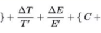

“体验度量”是近两年在前端和设计圈比较流行的一个概念。讲简单点，就是用一个具体的量化指标来描述人类对于一个产品的主观体验，比如这个产品的体验是80分，或者90分，而这个最终的分数不是拍脑袋给出来的，是根据提前制定好的体验指标计算出来的；讲复杂点，大厂们各显神通，纷纷制定了自己的体验度量模型，比如阿里云的UES系统，蚂蚁金服的PTECH模型，还有谷歌的HEART模型等。

体验度量跟前端监控强相关，可以说度量是监控的一个超集。所以先简单介绍一下前端监控，主流的前端监控主要采集性能、错误、用户行为、PV、UV、停留时长等数据，用于日常问题定位和分析。而体验度量，则是在这些基础指标之上，添加部分新的指标，并进行多维度的组合计算，给产品得出一个最终的体验分数。

以蚂蚁金服的PTECH模型来举例，PTECH分别对应着Performance（性能）、Task Success（任务体验）、Engagement（参与度）、Clarity（清晰度）、Happiness（满意度）五个词。
（1）性能值通过页面加载时长和请求响应时长等进行计算，背后的逻辑也非常简单，响应时间越快，用户体验越好。
（2）任务体验则使用关键任务增长指数和关键任务转化指数进行衡量，而关键任务的数据就需要进行产品分析和用户行为埋点得到。
（3）参与度通过访问用户、访问频次、和用户留存进行描述，这是非常基础的监控指标，用的人越多，剩的人越多，侧面上就可以反映出你这个产品越好用、有用
（4）清晰度，通过用户行为埋点和问卷调查计算出设计规范得分和清晰度得分，我在网上看到的设计规范没有展开讲，但是我猜有可能使用了参考链接“一致性量化评测体系”中的检测方案
（5）满意度，通过问卷调研、用户访谈和反馈文本情感分析得出满意度得分

得到上述五个维度的数值后，计算出一个总的产品体验得分，如下图所示，具体的计算加和方式，说实话，我还没看懂，我再研究研究。

B端体验度量模型：https://www.leadwhite.net/measure/#PTECH
一致性量化评测体系：https://mp.weixin.qq.com/s/AtAa9gBw3jhLfDFOtkl4Lg

