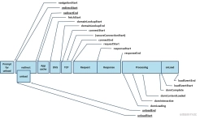

性能，讲通俗一点，就是描述有多快。所以，网站的加载性能，其实就是一个网站从刷新到呈现出最终的内容的速度有多快。

一个网站从开始访问那一刻起，到完成加载要经过上一个页面卸载、重定向、缓存查询、建立连接、请求内容、渲染等若干个环节。那么其中每个环节的耗时如何计算，有一个非常经典的图可以回答这个问题。

PerformanceTiming（https://developer.mozilla.org/zh-CN/docs/Web/API/PerformanceTiming）是window 上的一个全局对象，它提供了在加载和使用当前页面期间发生的各种事件的性能计时信息。
通过各个阶段的时间戳运算，我们就可以得到一些非常基础的性能指标，比如说：

DNS解析时间： domainLookupEnd - domainLookupStart
建立连接时间： connectEnd - connectStart
白屏时间： responseStart - fetchStart
DOM渲染完成时间： domContentLoadedEventEnd - fetchStart
页面加载完成时间： loadEventEnd - fetchStart

通过上述计算出的各个基础指标，我们就可以明确，某一次的加载性能如何，具体哪一个阶段慢，进行阶段性优化。不过PerformanceTiming 目前已经废弃了，不推荐使用，可以使用PerformanceNavigationTiming（https://developer.mozilla.org/en-US/docs/Web/API/PerformanceNavigationTiming/redirectCount）代替，与PerformanceTiming 相比，PerformanceNavigationTiming 的可读性会更好，因为它的数值显示使用的不是时间戳，而是当前页面从加载开始到现在经过的ms 数。PerformanceNavigationTiming 还在实验阶段，且浏览器兼容性相对较差（不兼容IE浏览器，其实还好）

除了上述提到的基础性能指标之外，业界还有很多描述能力更强，但是相对不太容易计算的指标。比如下述几种：

FMP：首次有意义渲染，淘宝、贝壳、小红书等C 端产品特别关注这个指标，他们在致力于寻找对用户最有用的那个元素什么时候可以渲染出来。目前通用的做法是通过MutationObserver 监听DOM 元素变化，并基于元素大小、位置、可见性等给每一次变化计算一个评分，将评分上升最陡峭的地方定义为FMP 时间点。

LCP：最大内容渲染时间，Google 提出的核心WEB 性能指标之一。测量渲染视口中最大内容的时间。它还可以配置为测量特定内容的加载时间，而不仅仅是大小最大的内容。LCP 的理想数字是 2.5 秒或更短。

FID：首次输入延迟，核心WEB 性能指标之一。测量用户尝试与网站的一部分进行交互的时间与界面能够响应该交互的时间之间的延迟。理想情况下，FID 不应超过 100 毫秒。

CLS：累计布局偏移，核心WEB 性能指标之一。测量页面加载时布局的变化。该指标是根据元素相对于视口的移动量（影响分数）以及它们移动的距离（距离分数）计算得出的。CLS 的好分数是 0.1 或更低。

FMP 计算方式：https://segmentfault.com/a/1190000017092752
核心WEB 性能指标：https://web.dev/vitals/
WEB 性能指标速查表：https://bitsofco.de/web-performance-metrics-cheatsheet/

