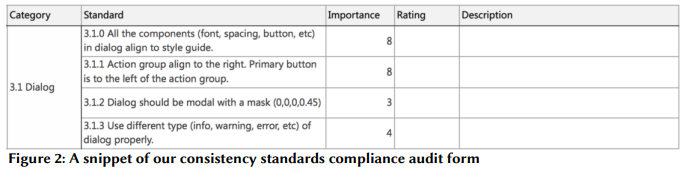
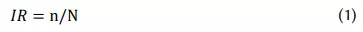
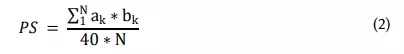
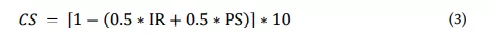

最近在探索页面一致性检测的时候，发现了阿里的一篇论文：How Consistent Is Your GUI Design？看完文章，颇受启发，在这里分享一下。关于度量页面一致性这件事情，文章中给出了下述解法。

第一步，由前端和设计等对体验比较关注的人员商讨制定50个基础指标，每个指标设置1-10不同的权重，表示这个指标对人的感官的影响程度。典型的指标如下图1所示，比如弹框中的文字、空格、按钮等是否遵从风格规范，弹框是否有遮罩等。

第二步，找三个了解规范的设计专家审查页面，根据上述基础指标所定义的问题的出现次数，给定每个问题0-4不同的出现频率。每个专家花一个小时左右，去评估一个产品的上述50个指标。除了要给程度之外，还要写明原因。一方面，用于举证；另一方面，用于指导业务修复。

第三步，基于上面统计到的数据，计算跟一致性体验相关的两个重要指标：IR（Incompliance Rate，不合规率）和PS（Overvall Problem Severity，整体问题严重性）。IR 的计算方式如公式（1）所示，PS 的计算方式如公式（2）所示。

IR 计算公式中，n 代表有问题的指标数量，N 代表所有基础指标数据量，也就是50。

PS 计算公式中，a代表当前问题的严重程度，1-10，用于描述一旦被察觉到，对视觉的影响有多大；b代表问题规模，0-4，用于描述是否容易被用户察觉到（0-4实际上是五级了，应该是1-4或者0-3，分级这块论文里论述得不是很严格）。

第四步，通过公式（1）和公式（2）计算得到IR 和PS 的数值以后，使用公式（3）计算出最终的CS（Consistency Score，一致性得分）数值，最终得分的范围为0-10，得分越高，表示产品的一致性程度越好。

文中提到的评估思路和方式，都很有启发。但是存在的一个问题是，成本太高。评估一个产品，需要若干个专家对照着checklist 和产品页面审查一个小时。

所以，在这篇论文的基础之上，我们团队目前在尝试的方向是，寻找可量化、能自动化检测的基础指标，比如说颜色、阴影、圆角、图标等，然后使用特定的公式计算产品的一致性得分。在这其中，权重仍然是一个非常重要的因素。探索初期，我打算选择几个重点服务的top 访问页面，通过参数的调整和指标的组合计算出不同的体验得分，使之最终可以匹配上公司内权威的体验专家给各个页面的评分。

