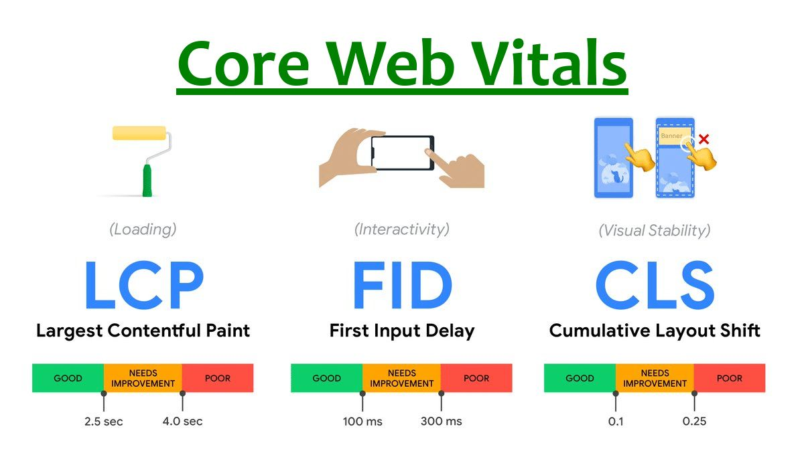

Core Web Vitals 是Google 于2020 年提出的三个用于描述用户体验的核心web 指标：LCP、FID、CLS。最近在往产品添加这三个指标，深入到细节后才发现这三个指标与想象中的稍微有点不一样，今天就来看看这三个指标分别是度量什么，以及如何计算。

1、LCP，Largest Contentful Paint，最大内容绘制。
用于描述网站中最大块的元素渲染出的时间，这里的元素包含图像、video、背景图像或包含文本元素的块级元素。为了提供良好的用户体验，网站应该努力将LCP 控制在2.5s 以内。LCP 指标背后的观点是，我们认为页面上最大块的元素对用户的视觉感知影响最大。

LCP 的计算方式有两种，一种是通过PerformanceObserver 监听largest-contentful-paint 事件，观测一次次产出值，然后找到最近的一次值；第二种是直接调用web-vitals 库的getLCP 方法。

使用第一种方法获取LCP 值的时候，会多次触发监听事件，因为随着时间的推移，最大的元素是会发生变化的。使用第二种方法，即web-vitals 的api 获取LCP 值的时候，你会发现，只有当产生交互（点击、按键）的时候，才会输出LCP 值，如果你刷新页面，一直不动，这个值就一直不会打印出来。这又是Google 对性能值统计的一个关键理解：也就是说，当用户开始交互的时候，我们认为这个页面才真正加载完了，那这个时候，我再来看，从页面加载到现在，发生最大页面元素变化的时间点在什么时候。

2、FID，First Input Delay，首次输入延迟。
用于描述网站需要花费多长时间对用户的第一次交互产生回应。这是一个只有在真实访问情况下才能统计到的指标，因为它的前提是产生交互。也就是说，如果一个用户刷新页面后，一直不跟页面进行交互，那么这个指标值就永远获取不到。

FID 的计算方式，同样有两种，一种是通过PerformanceObserver 监听first-input 事件，然后通过processingStart 和startTime 的差值来确定输入延迟；第二种是直接调用web-vitals 库中的getFID 方法。

另外，不同用户跟页面产生交互的时机可能不同，有的人在计算任务密集的时候交互，有的人空闲的时候交互，这就会导致对于同一个网站，这个值可能差别很大。所以Google 的建议是，观测75% 位点的值，这个值应该小于100ms，即75% 以上的首次点击都能在100ms 内得到回应。

3、CLS，Cumulative Layout Shift，累计布局偏移。
CLS 要捕捉的是我们在网站访问过程中突然发生的意料之外的布局偏移情况，比如我们正在看一篇写满文字的博客，1-2s后，顶部突然出现一张图片，把所有的文字都挤到了下面去。原来文章顶部有图片，只是一直没有加载出来。

CLS 测量整个页面生命周期内发生的，所有意外布局偏移中最大一连串的布局偏移分数。谷歌要求页面的CLS最好保持小于 0.1。

所谓的一连串，是靠检测布局偏移过程中的滑动窗口算法给出的分割结果。大概的分割思路是，同一个窗口中的布局偏移，每次偏移相隔的时间小于1s，整个窗口的最大持续时间为5s。

所谓的意外，是指非交互引起的布局偏移。比如当我们点击一个下拉菜单的时候，展开一片内容，这种场景是合理的。所以在统计的时候会去掉交互时间后的500ms 的时间。

CLS 的计算方式，一种是通过PerformanceObserver 监听first-input 事件layout-shift 事件，将偏移内容的大小和偏移距离分别最为最终结果的两个计算因子：影响分数和距离分数，相乘；第二种是调用web-vitals 库中的getCLS 方法。

CLS 在页面加载和交互过程中会进行持续，若干次的变化。当我们使用web-vitals 的api 获取的时候会发现，只有页面的可见性发生变化的时候，才会打印一次CLS 结果，比如切换到其他浏览器tab，再切回来。这大概就是上面提到的生命周期。

参考：https://web.dev/vitals/

