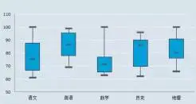

今天分享一个数据分析中很有意思的工具【箱线图】。箱线图可以用来反映一组或多组连续型定量数据分布的中心位置和散布范围，什么意思呢？这一句抄下来，其实我也有点懵。简单来讲，就是可以让我们非常直观地看出数据的大概分布。箱线图绘制出来就像个箱子，如下图所示。

箱线图可以用于离群点（异常值）的过滤，主要是通过数据排序后拿到四分之一位点的值Q1和四分之三位点的值Q3，然后通过Q3+1.5(Q3-Q1)和Q1-1.5(Q3-Q1)分别计算出上下边界的值，边界以外作为离群点处理。

上边界、四分之三位点、四分之一位点、下边界，再加上中位数就是箱线图中的关键绘制元素。

箱线图常见的应用场景包括：不同年级或不同科目成绩对比、职员薪酬分布、运动员水平分析，以及其他各种各样类型的学术研究。

所以在前端性能监控领域，我们是不是可以用箱线图对加载性能列表的数值进行异常值过滤呢？

箱线图案例分析：https://www.jianshu.com/p/55f823f0ce47
箱线图异常值检测：https://www.zhihu.com/question/36172806
常见的异常值检测算法：https://www.secrss.com/articles/11994

