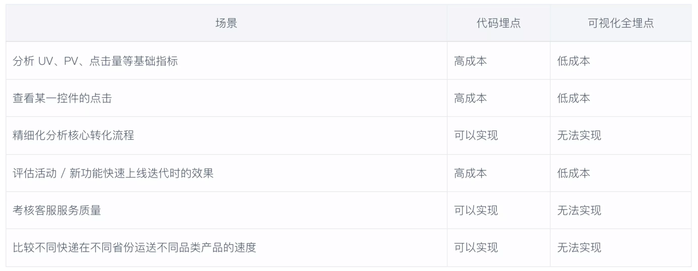
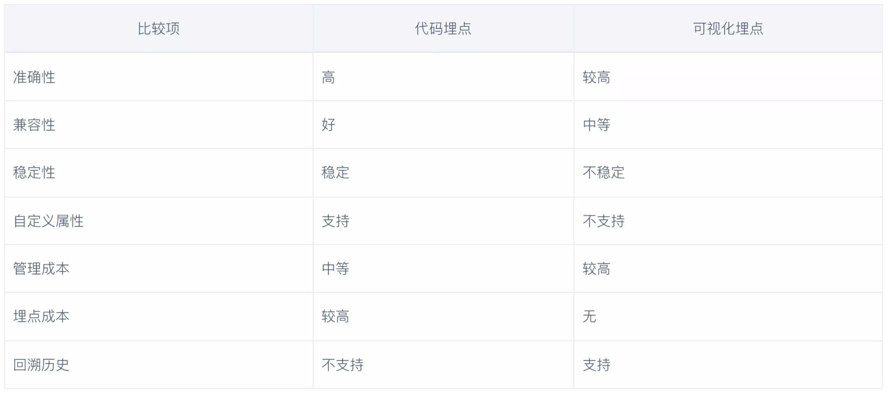

分享一个今天在“神策数据”的帮助中心中看到的概念，“可视化全埋点”（参考链接：https://manual.sensorsdata.cn/sa/latest/difference_track_visual_track-7547408.html）。在介绍这个概念之前，我们先来看另一个与之对应的概念，“代码埋点”。两种埋点，都是建立在业务已经接入了一种提供埋点能力的监控工具的基础之上。

“代码埋点”相对来说比较容易理解。举个例子，一个电商业务，想知道用户从加入购物车，到结算订单，再到支付（我们称之为一个场景）。在上述场景中，整体的完成率是多少，耗时大概多长等信息，就可以在业务代码中对应的位置分别设置埋点上报信息获得。然后通过数据分析可能存在的问题，优化产品设计。

“代码埋点”统计到的数据准确率高，但是埋点操作是侵入式的，需要修改业务代码，接入成本较高。“可视化全埋点”是一种跟“代码埋点”目的相同，但是所具备的特性恰恰相反的一种操作。

“可视化全埋点”默认将全部的页面浏览和大部分点击行为收集起来，当你需要观测一个场景的数据时，只需要在页面的截图上（可视化）选出想要添加的元素，就可以拼凑出一个完整的场景。进而查看这个场景中完成率、完成时长、流失率等相关指标。

除此之外，我还在帮助中心里看到及个非常好的观点、建议和实践，记录如下：
1、考虑到可视化全埋点的事件还可能会随着时间推移失效，这就意味着核心的业务相关的监控用可视化全埋点实现并不是一个好事。
2、如果你所在的公司，规模较大、研发资源相对充足，并且对于建设一个牢固的数据根基有着很强的愿望，那么代码埋点是最佳的选择；如果使用可视化全埋点，很可能会导致延误自身数据根基建设的时机。
3、鉴于日常功能更新可能会导致“可视化全埋点”失效这个事实，可以通过智能观测数据波动来给用户进行预警，比如计算同环比并考虑周末、节假日等因素

