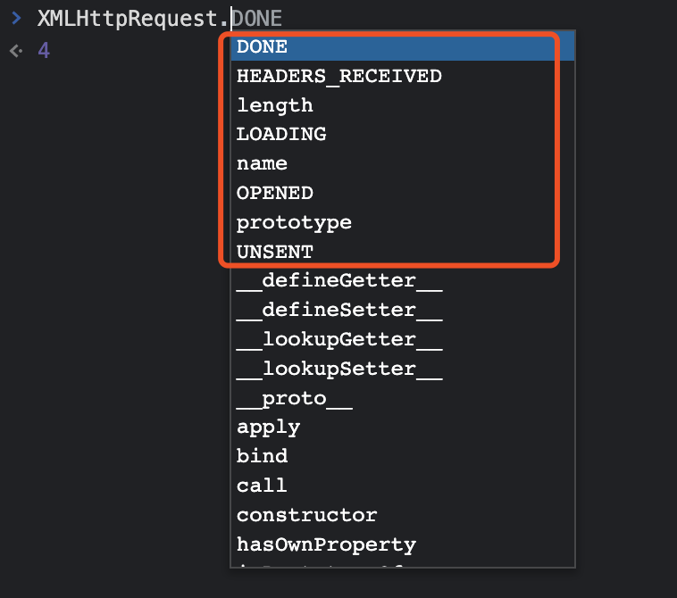

今天来探讨一下WEB 监控中的工具中的API 监控，关于API，我们主要关注的是API 的调用次数、方法、调用耗时、状态码、错误信息等。WEB API 的监控主要分为两种：XMLHttpRequest 和Fetch，今天主要聊XMLHttpRequest。

监控的过程其实非常简单，只需要代理一下XMLHttpRequest 对象，在对象中的send 方法中添加load 监听，在接口调用完成时，收集上述提到的各种数据进行上报。最简单的写法，十多行就能实现，可以参考：http://ashita.top/front/js-monitor-ajax.html

除了满足最基本的监听之外，我们还需要考虑一些问题。

第一点，我们需要开放监听API 屏蔽的能力，这样可以让用户对不想统计的API 或第三方API 进行屏蔽。

第二点，当一个API 耗时非常高的时候，我们希望能知道API 在网络、TTFB 和内容下载等各个阶段的耗时，这个信息通过代理XML 对象无法拿到，所以需要从performance 对象中获取。随之而来的一个问题就是，存放performance 对象的缓冲区是有一定大小的，当页面运行时间过长时，这个缓冲区会被填满，无法放入新的信息，所以我们需要在缓冲区填满时进行清除：https://developer.mozilla.org/zh-CN/docs/Web/API/Performance/clearResourceTimings

第三点，很多公司实现了接口的全链路监控，在接口返回值的header 中会添加一个traceId，凭借这个traceId，就可以知道接口在后端调用过程中的全部路径，以及耗时，当我们在前端监控时，可以将这个traceId 一同收集起来。

第四点，API 的监控存在一个极限，就是只有在你的监控代码运行之后的API 请求才能监控到，在这之前就发出的API 会漏掉，当然这个问题有解法，可以在第一次API 数据上报时检查一下performance 对象中是否存在未被监控到的API 请求。

第五点，会有一种场景反复出现，那就是前端监控到的API 耗时非常高，但是链路追踪的后端耗时却非常低，可能是几百毫秒跟几十秒的差别。这种问题通常出在浏览器上，各种原因导致浏览器处理性能下降（比如短时间内打开大量页面，触发同一个页面的接口调用），大量的API 在浏览器端排队，理论上来说，这部分时间在我们的API 分阶段耗时中是可以体现出来的。

第六点，监控的时候注意只进行局部代理，比如只代理open， send 方法等，避免直接代理整个对象，否则会出现非必要覆盖的情况，在之前的实践中就出现过XML 对象原生属性被覆盖的情况。

