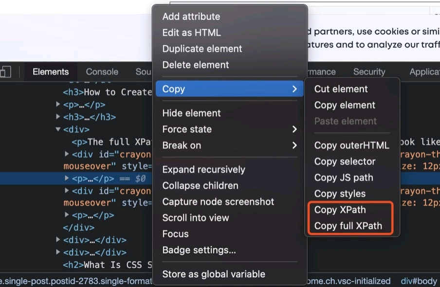

今天分享一篇介绍xpath 和selector 以及两者各自优势的文章，文章的标题是，
XPath vs CSS Selector: The Difference and How to Choose，链接点这，https://www.testim.io/blog/xpath-vs-css-selector-difference-choose/

Xpath 的全称是xml path，是一种基于xml 文档的查询语言，html 也属于xml，所以在html中也可以使用xpath 来标记元素信息。xpath分为两种，xpath 和full xpath，同一个dom 元素对应的表示分别如下：
```
//*[@id="scroll-container"]/main/search-box-component//div/form/div/button
/html/body/main-view//section/startpage-component//div/main/search-box-component//div/form/div/button
```

在访问一个网站的时候，打开F12，随便选择一个元素，右键，copy，就可以复制出当前元素的xpath，selector 同理。

Xpath的优势是兼容性好，包括老版IE浏览器；创建灵活；可以使用contains 进行模糊匹配等。

Selector 是基于元素样式的，同样可以用于dom 元素的标记和定位，selector 可以基于class、id、attribute等。典型的selector长这样：
div > form > div > button
a[href^="some value here”]

是不是读起来挺友好的，用作者的原话说，You can read this as, “The button is a child element of the div inside a form, which is itself inside the div type selector.”

Selector 的好处是快；可读性好；学习成本低；浏览器兼容性也不差。

所谓的快，到底有多快呢？作者在文章里说，其实相差不大，主要还是看你使用的场景决定用哪一个。原话是这么说的，Besides, the execution time difference between XPath and CSS selectors is not such that you could do meaningful work while others wait. Such a negligible difference means that both options may be running neck-and-neck for you at this point.

不过从我的使用经历来看，selector 比xpath 快的真不是一点半点，至少在十倍以上。我在公司负责的监控产品有做热力图的功能，一开始使用xpath 进行元素定位，热力的渲染往往需要花几秒钟，后来我把它换成了selector，几百ms就可以完成渲染。我也有单独对部分元素进行渲染速度比较，一个元素的差距可能就是几百ms和十几ms的差距，如果真的要用的话，还是推荐selector。

