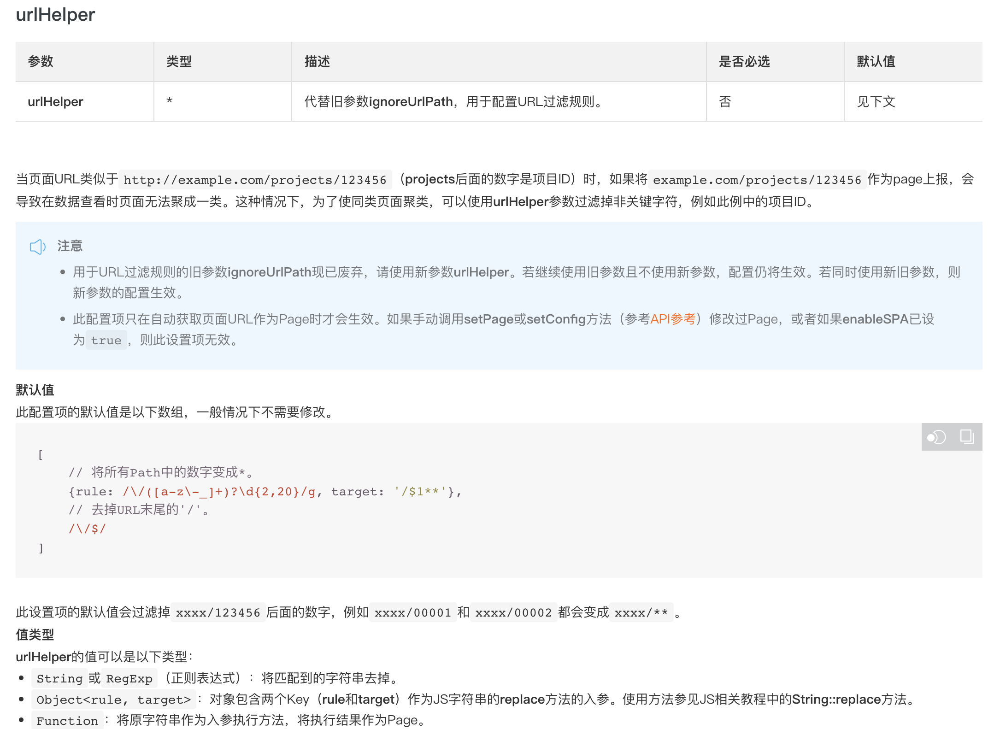

一个很常见的业务场景，https://xxx/post/1 和https://xxx/post/2 实际上是同一个页面，只是url 上携带的id 不同，页面上呈现的内容就不同。针对这种场景，在收集上报监控数据的时候，使用方会希望将这两个url 聚合到一起展示，我们不妨称之为formatedUrl。如何将url 聚合为formatedUrl，有两种思路：一是在脚本接入侧配置聚合规则，二是在数据上报后配置聚合规则。

