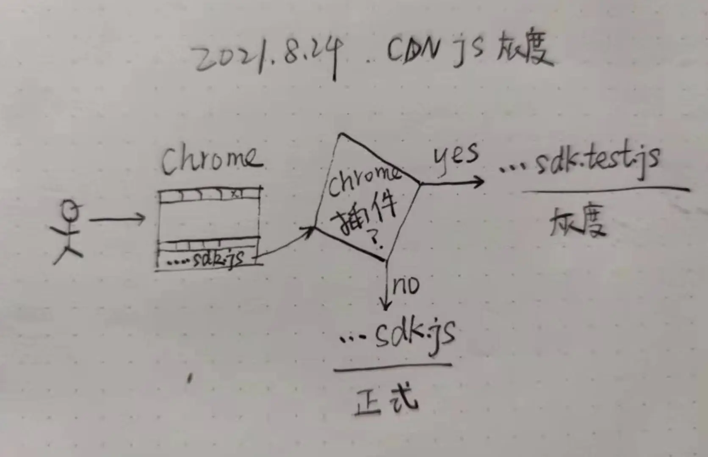

假设现在有一个地址固定的js文件放在CDN上，文件地址为，cdn.huaweicloud.com/sdk.js. 这个文件被多个服务引用，而且会定期更新，那么我们在更新功能的时候应该如何进行灰度测试？

今天就上述场景提供一个解法：通过浏览器插件来改变访问某个网站时对特定资源的引用链接。本期内容参考文章：How to Create a Chrome Extension in 10 Minutes Flat（https://www.sitepoint.com/create-chrome-extension-10-minutes-flat/）

一个简单的浏览器插件主要包含以下几个部分：
1、icon.png. 就是你的插件在浏览器右上角长啥样
2、manifest.json. 关于这个插件的介绍
3、popup.html & popup.js. 这两个文件分别定义了点击插件时的弹出内容长啥样，比如说有什么按钮，什么表单，以及点击按钮后会发生什么
4、background.js. 这个文件里可以添加相关逻辑，影响浏览器的部分行为

不对上述几个部分展开介绍，可以查看上面链接获取更多信息。下面就用浏览器插件来回答如何解决最开始提到的那个场景。

其实很简单，我们在background.js里面添加一段逻辑判断，即当我请求到的资源包含sdk.js时，就将当前请求重定向到测试文件的位置，比如，cdn.huaweicloud.com/sdk.test.js，核心代码如下
```js
chrome.webRequest.onBeforeRequest.addListener(functions(details) {
  var url = details.url;
  if (url.indexOf('sdk.js') > -1) {
    result = { redirectUrl: 'cdn.huaweicloud.com/sdk.test.js' };
  }
  return result;
})
```
关于CDN静态资源的部署与灰度测试，你还有什么其他解法，欢迎在评论区留言讨论。

